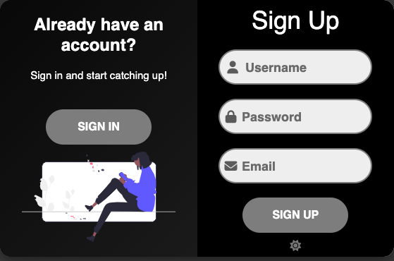

# CatchUp Messenger App 

## Description
An easy to use messenger app that allows users to make an account, log in and send messages to other online users. This project was made with node, javascript, handlebars and socket io. We built this project to challenge ourselves as developers and create a program that we could use. We learned how to initialize and integrate socket IO, work with Handlebars, deploy our project using Heroku, and practiced creating mySql models and relationships.

## Table of Contents
- [Installation](#installation)
- [Usage](#usage)
- [Screenshots](#screenshots)
- [Credits](#credits)

## Installation  

No installation is necessary. To use the application click on the link below:  
https://sheltered-sea-11068-ef6392f13d6a.herokuapp.com/chat  

Our github repo:   
https://github.com/smokhadar/project2main

## Usage
Once users have clicked on the first link above, they may create an account by clicking on the sign up button on the right side of page. There are moons located on both pages and clicking them changes the page to a dark mode. To return to the default light mode, click on one of the suns located below the login and sign up buttons. Users may create a username, a password that must be at least 8 characters long and be made up of numbers and letters, and enter their email to complete the signing up process. After clicking on the sign up button users will be able to see what friends are online when they look to the right of their window. They will then be able to receive messages from friends, text encased in green, and will be able to send messages, text encased in magenta. They may send messages by writing in the rouneded text box and clicking on the green paper-plane.

## Screenshots

  

  

## Credits  

### Collaborators:  

[Sarah](https://github.com/minutemin)  
[Deandra](https://github.com/ddiedrick)  
[Nidhi](https://github.com/shahnidhi20)  
[Paola](https://github.com/perfectblue0)  
[Samira](https://github.com/smokhadar)

### Tutorials:  

- [Responsive Sign In & Sign Up Form Using HTML & CSS & JS |  Login & Registration Form ](https://www.youtube.com/watch?v=aAyxSExhwW4)  

- [Deploy with Heroku and MySQL](https://coding-boot-camp.github.io/full-stack/heroku/deploy-with-heroku-and-mysql)  
 
- [Deploy Client Server to Heroku](https://www.youtube.com/watch?v=GJwHevf2wYE)  

## License
- [MIT License](https://opensource.org/licenses/MIT)

